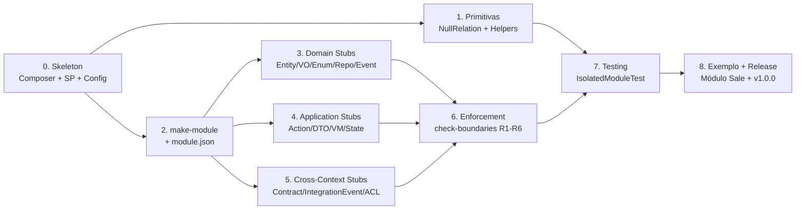

# Plano de Sprints — Extensão `laravel-modules-arch`

> Plano de execução solo, sem time-box, ordenado por dependência técnica e valor entregue. Cada incremento é independente de tempo mas dependente dos anteriores conforme indicado em **Pré-requisitos**. O MVP (v1.0.0) cobre todos os incrementos de **0 a 8**.

---

## Status

**Todos os 9 incrementos foram concluídos. Release: `v1.0.0` (2026-05-27).**

| # | Incremento | Status | Commit |
|---|---|---|---|
| 0 | Skeleton do pacote | concluído | [`792187b`](../../commit/792187b) |
| 1 | Primitivas de modularização | concluído | [`960e4f7`](../../commit/960e4f7) |
| 2 | `arch:make-module` + schema | concluído | [`1d960d3`](../../commit/1d960d3) |
| 3 | Geradores Domain | concluído | [`cca6d3d`](../../commit/cca6d3d) |
| 4 | Geradores Application | concluído | [`3885d2b`](../../commit/3885d2b) |
| 5 | Geradores cross-context | concluído | [`aa9acf3`](../../commit/aa9acf3) |
| 6 | `arch:check-boundaries` (R1-R6) | concluído | [`d1c8712`](../../commit/d1c8712) |
| 7 | Testing utilities | concluído | [`b2da506`](../../commit/b2da506) |
| 8 | Exemplo Sale/Crm + release v1.0.0 | concluído | [`81fb432`](../../commit/81fb432) + [`bf68da5`](../../commit/bf68da5) |

**Métricas finais:** 175 testes verdes, PHPStan level 8 limpo, Pint limpo, CI matrix PHP 8.2/8.3/8.4 × Laravel 11/12.

---

## Visão Geral

**Princípios de ordenação:**

1. **Skeleton primeiro** (I0): nada compila sem o pacote registrado.
2. **Primitivas antes de geradores** (I1 antes de I2): os stubs gerados referenciam `NullRelation`, `RegistersModuleMorphMap`, etc.
3. **Geradores por camada** (I3 → I4 → I5): seguindo a direção das dependências DDD (Domain → Application → Cross-Context).
4. **Enforcement depois dos geradores** (I6): só faz sentido validar regras quando há código de exemplo para validar.
5. **Testing utilities depois do enforcement** (I7): `IsolatedModuleTest` é usado pelo módulo de exemplo da release.
6. **Release por último** (I8): consolida tudo num módulo Sale completo que serve de tutorial vivo.

**Métrica de conclusão de incremento:** todos os critérios de aceitação verdes + cobertura mínima de 80% nos arquivos novos + PHPStan nível 8 sem warnings.

---

## Incremento 0 — Skeleton do Pacote

**Objetivo:** ter um pacote Composer instalável que registre seu ServiceProvider via auto-discovery e publique um arquivo de config.

**Entregáveis:**

- [ ] `composer.json` com PSR-4 `LaravelModulesArch\\` → `src/`
- [ ] `composer.json` com require: `php ^8.2`, `laravel/framework ^11.0|^12.0`, `nwidart/laravel-modules ^11.0`
- [ ] `composer.json` com require-dev: `phpunit/phpunit`, `orchestra/testbench`, `phpstan/phpstan`, `larastan/larastan`, `laravel/pint`, `nikic/php-parser ^5.0`
- [ ] `src/LaravelModulesArchServiceProvider.php` (registra binds, publica config, registra comandos placeholder)
- [ ] `config/modules-arch.php` com schema completo (modes, boundaries, ignored_namespaces) — conforme `extension_complete_reference.md` Parte 6
- [ ] `composer.json` → `extra.laravel.providers` para auto-discovery
- [ ] `tests/TestCase.php` (base usando Testbench + nwidart/modules carregado)
- [ ] `phpunit.xml`, `phpstan.neon` (nível 8), `pint.json`
- [ ] `.github/workflows/ci.yml` (PHPUnit + PHPStan + Pint check)

**Critérios de aceitação:**

- `composer install` em um projeto Laravel limpo registra o ServiceProvider automaticamente
- `php artisan vendor:publish --tag=modules-arch-config` cria `config/modules-arch.php`
- `php artisan list` mostra a seção `arch:*` (mesmo que vazia)
- CI verde no primeiro commit

**Referência:** `extension_complete_reference.md` Parte 6.

**Pré-requisitos:** nenhum.

---

## Incremento 1 — Primitivas de Modularização (Parte 1)

**Objetivo:** entregar as 4 primitivas que permitem módulos sobreviverem à desativação de seus pares.

**Entregáveis:**

- [ ] `src/Relations/NullRelation.php` estendendo `Illuminate\Database\Eloquent\Relations\Relation`
  - Implementa `addConstraints`, `addEagerConstraints`, `initRelation`, `match`, `getResults`
  - Nunca executa query
- [ ] `src/Support/ModuleAwareRelation.php` com métodos estáticos:
  - `hasMany`, `hasOne`, `belongsTo`
  - `morphMany`, `morphOne`, `morphTo`
  - Cada um checa `Module::isEnabled($name)` antes de delegar
- [ ] `src/Concerns/RegistersModuleMorphMap.php` (trait):
  - Método abstrato `morphMap(): array`
  - Método `bootModuleMorphMap()` que chama `Relation::morphMap()` (aditivo, não destrutivo)
- [ ] `src/Support/CrossModuleAction.php`:
  - Método estático `run(string $module, string $actionClass, array $params = [], mixed $default = null): mixed`
  - Resolve via `app()` para suportar DI
  - Retorna `value($default)` se módulo inativo ou classe inexistente

**Testes:**

- [ ] `tests/Unit/Relations/NullRelationTest.php`: garante zero queries (`DB::pretend`) em eager e lazy loading
- [ ] `tests/Feature/Support/ModuleAwareRelationTest.php`: com módulo ativo retorna `HasMany` real; inativo retorna `NullRelation`
- [ ] `tests/Unit/Concerns/RegistersModuleMorphMapTest.php`: dois módulos registram morph aliases sem sobrescrever
- [ ] `tests/Feature/Support/CrossModuleActionTest.php`: módulo ativo executa; inativo retorna default; classe inexistente retorna default

**Critérios de aceitação:**

- `$lead->quotations` retorna `Collection` vazia sem tocar no DB quando módulo Sale está desabilitado
- `Lead::with('quotations')` não executa query para `quotations` quando Sale desabilitado
- Registrar morph map em dois módulos diferentes preserva ambos (não destrutivo)

**Referência:** `extension_complete_reference.md` Parte 1 (seções 1-4).

**Pré-requisitos:** I0.

---

## Incremento 2 — `arch:make-module` + Schema `module.json`

**Objetivo:** comando que gera o esqueleto completo de um Bounded Context, com `module.json` validado.

**Entregáveis:**

- [ ] `src/Console/Commands/MakeModuleCommand.php` (`arch:make-module {name} {--mode=pragmatic|purist}`)
- [ ] `resources/stubs/module/` com:
  - `module.json.stub` (schema completo conforme Parte 4 seção 17)
  - `Infrastructure/Providers/ModuleServiceProvider.stub` (já usa `RegistersModuleMorphMap`)
  - `composer.json.stub` para o módulo
  - `Contracts/.gitkeep`, `Domain/{Entities,ValueObjects,Enums,Repositories,Events,Exceptions}/.gitkeep`
  - `Application/{Actions,DTOs,ViewModels,Validators}/.gitkeep`
  - `Infrastructure/{Http/Controllers,Http/Requests,Http/Resources,Persistence/Models,Persistence/Repositories,ACL,Providers}/.gitkeep`
  - `database/{migrations,factories,seeders}/.gitkeep`
  - `routes/{web,api}.php.stub`
  - `tests/{Unit/Domain,Feature/Application}/.gitkeep`
- [ ] `src/Support/ModuleJsonSchema.php` — validação JSON Schema do `module.json`
- [ ] `src/Support/StubRenderer.php` — substituição de placeholders (`{{ NAME }}`, `{{ NAMESPACE }}`, etc.)
- [ ] Diferença `pragmatic` vs `purist`:
  - **pragmatic** (default): omite `Domain/Entities/`, `Domain/Repositories/`, `Domain/ValueObjects/` (Eloquent serve de entidade)
  - **purist**: gera tudo, e desliga R4 no config

**Testes:**

- [ ] `tests/Feature/Console/MakeModuleCommandTest.php`:
  - `arch:make-module Sale` cria todas as pastas
  - `arch:make-module Sale --mode=purist` inclui `Domain/Entities`
  - `arch:make-module Sale --mode=pragmatic` omite `Domain/Entities`
  - `module.json` gerado passa validação de schema
- [ ] `tests/Unit/Support/ModuleJsonSchemaTest.php`: validação de schemas válidos e inválidos

**Critérios de aceitação:**

- `php artisan arch:make-module Sale` cria estrutura completa em `Modules/Sale/`
- `module.json` validado contra schema
- ServiceProvider gerado é registrável e bootável sem erro

**Referência:** `extension_complete_reference.md` Parte 4 seção 17 e Parte 6; `ddd_structure_explained.md` (estrutura completa).

**Pré-requisitos:** I0, I1.

---

## Incremento 3 — Geradores de Domain (Parte 2)

**Objetivo:** stubs e comandos para gerar todos os artefatos da camada de Domínio.

**Entregáveis:**

- [ ] `arch:make-entity {module/name}` → `Modules/{Module}/Domain/Entities/{Name}.php`
  - Stub com `pullDomainEvents()`, `recordEvent()`, construtor com `readonly string $id`
- [ ] `arch:make-value-object {module/name}` → `Modules/{Module}/Domain/ValueObjects/{Name}.php`
  - Stub `final readonly` com `equals()`, validação no construtor
- [ ] `arch:make-enum {module/name}` → `Modules/{Module}/Domain/Enums/{Name}.php`
  - Stub com `canTransitionTo()` (estado finito)
- [ ] `arch:make-event {module/name}` → `Modules/{Module}/Domain/Events/{Name}.php`
  - Stub `final readonly` POPO, sem `Illuminate\Events\Dispatchable`
- [ ] `arch:make-repository {module/name}` → gera **dois** arquivos:
  - `Modules/{Module}/Domain/Repositories/{Name}RepositoryInterface.php`
  - `Modules/{Module}/Infrastructure/Persistence/Repositories/Eloquent{Name}Repository.php`
  - Atualiza `ModuleServiceProvider` adicionando o `bind()` automaticamente
- [ ] `arch:make-exception {module/name}` → `Modules/{Module}/Domain/Exceptions/{Name}.php`
  - Stub estendendo `\DomainException` com named constructors

**Testes:**

- [ ] Para cada comando: arquivo gerado existe, namespace correto, parsa via `nikic/php-parser` sem erro
- [ ] `arch:make-repository` adiciona binding ao ServiceProvider sem quebrar bindings existentes
- [ ] Stub do `--mode=pragmatic` não gera `Domain/Entities` (apenas Eloquent)

**Critérios de aceitação:**

- Todos os stubs compilam (PHP `-l`) sem erro
- `php artisan arch:make-entity Sale/SaleOrder` produz arquivo idêntico ao exemplo de `ddd_structure_explained.md` §1.1
- Binding do repository é idempotente (rodar 2x não duplica)

**Referência:** `extension_complete_reference.md` Parte 2 seções 5-9; `ddd_structure_explained.md` §1.

**Pré-requisitos:** I2.

---

## Incremento 4 — Geradores de Application (Parte 3)

**Objetivo:** stubs e comandos para a camada de Aplicação.

**Entregáveis:**

- [ ] `arch:make-action {module/name}` → `Modules/{Module}/Application/Actions/{Name}.php`
  - Stub com `handle()` recebendo DTO tipado (placeholder)
- [ ] `arch:make-dto {module/name}` → `Modules/{Module}/Application/DTOs/{Name}.php`
  - Stub `final readonly` com `fromRequest()` e `fromArray()`
- [ ] `arch:make-view-model {module/name}` → `Modules/{Module}/Application/ViewModels/{Name}.php`
  - Stub com métodos públicos (não properties) para a view consumir
- [ ] `arch:make-state {module/name}` → `Modules/{Module}/Domain/Enums/{Name}.php`
  - Variante de `make-enum` com `transitionTo()` que lança `\DomainException`
- [ ] `arch:make-validator {module/name}` → `Modules/{Module}/Application/Validators/{Name}Rules.php`
  - Stub com método estático `rules(): array`

**Testes:**

- [ ] Cada comando: arquivo gerado existe e é parseável
- [ ] DTO gerado tem `fromRequest` e `fromArray` (assert via reflection)
- [ ] Action gerada tem assinatura `handle(): mixed` quando sem DTO; com DTO usa o tipo correto

**Critérios de aceitação:**

- Stubs alinhados com exemplos de `ddd_structure_explained.md` §2
- Comandos respeitam `--mode` (no `purist` a Action injeta `RepositoryInterface`; no `pragmatic` injeta Eloquent Model)

**Referência:** `extension_complete_reference.md` Parte 3 seções 11-14; `ddd_structure_explained.md` §2.

**Pré-requisitos:** I2 (independente de I3 — pode ser feito em paralelo se houver tempo).

---

## Incremento 5 — Geradores Cross-Context (Contracts + Integration + ACL)

**Objetivo:** stubs para a fronteira pública entre módulos.

**Entregáveis:**

- [ ] `arch:make-contract {module/name}` → `Modules/{Module}/Contracts/{Name}.php`
  - Stub de `interface` com docblock explicando que é API pública
  - Atualiza `module.json` adicionando ao `contracts.publishes`
- [ ] `arch:make-integration-event {module/name}` → `Modules/{Module}/Contracts/Events/{Name}.php`
  - Stub `final readonly` POPO com primitivos
  - Atualiza `module.json` adicionando ao `events.publishes`
- [ ] `arch:make-acl-listener {module/name} {--for=ModuleName/EventName}` →
  - `Modules/{Module}/Infrastructure/ACL/{Name}.php`
  - Stub injetando Action interna no construtor
  - Atualiza `module.json` adicionando ao `events.subscribes`
  - Registra listener no `ModuleServiceProvider`

**Testes:**

- [ ] Cada comando atualiza `module.json` idempotentemente (sem duplicar entradas)
- [ ] Listener gerado é detectável via `Event::hasListeners()`
- [ ] `arch:make-acl-listener Sale/HandleLeadConverted --for=Crm/LeadConverted` valida que `Crm/LeadConverted` está em `Modules/Crm/Contracts/Events/` (não em `Domain/Events/`)

**Critérios de aceitação:**

- Comando recusa criar ACL listener para evento de `Domain/Events/` (precisa ser Integration)
- `module.json` permanece válido contra schema após cada operação

**Referência:** `extension_complete_reference.md` Parte 2 seções 9-10; `ddd_structure_explained.md` §3.6 e §4.

**Pré-requisitos:** I2 (independente de I3 e I4).

---

## Incremento 6 — Enforcement (`arch:check-boundaries`)

**Objetivo:** validação estática que falha CI quando regras DDD são violadas.

**Entregáveis:**

- [ ] `src/Console/Commands/CheckBoundariesCommand.php` (`arch:check-boundaries {--module=} {--strict}`)
- [ ] `src/Analysis/ModuleScanner.php` — varre `Modules/*` listando arquivos `.php`
- [ ] `src/Analysis/ImportExtractor.php` — usa `nikic/php-parser` para extrair `use` statements de cada arquivo
- [ ] `src/Analysis/Rules/`:
  - `R1_CrossModuleOnlyViaContracts.php`
  - `R2_DomainCannotImportInfrastructure.php`
  - `R3_DomainCannotImportApplication.php`
  - `R4_ApplicationCannotImportInfrastructure.php` (off por default no `pragmatic`)
  - `R5_SubscribedEventsMustBeDeclared.php`
  - `R6_RepositoriesOnlyForAggregateRoots.php` (warning, não erro)
- [ ] `src/Analysis/RuleResult.php` (level: error|warning, file, line, message, suggestion)
- [ ] Output formatado: tabela por módulo + resumo final
- [ ] `--strict`: exit code 1 se houver erros (warnings não falham)
- [ ] `--module=Sale`: limita a um módulo

**Testes:**

- [ ] Para cada regra: caso válido (passa) + caso inválido (falha) + caso edge (ignored namespaces)
- [ ] `--strict` em módulo limpo retorna exit 0; com violação retorna 1
- [ ] `--module=Sale` ignora violações em outros módulos
- [ ] `config('modules-arch.boundaries.ignored_namespaces')` realmente é ignorado

**Critérios de aceitação:**

- Rodar `arch:check-boundaries` no módulo de exemplo Sale (que será criado em I8) passa 100%
- Plantar 6 violações intencionais (uma por regra) e cada uma é detectada com mensagem clara
- Performance: análise de 50 arquivos < 2s

**Referência:** `extension_complete_reference.md` Parte 4 seção 15; `ddd_structure_explained.md` §4 ("Tudo fora de Contracts/ é PRIVADO").

**Pré-requisitos:** I3, I4, I5 (precisa de código para validar).

---

## Incremento 7 — Testing Utilities

**Objetivo:** ferramentas para testar módulos em isolamento e com dependências cross-module mockadas.

**Entregáveis:**

- [ ] `src/Testing/IsolatedModuleTest.php` (abstract class):
  - Property `protected array $enabledModules = []`
  - `setUp()`: desabilita todos os módulos, habilita apenas os declarados
  - `tearDown()`: reabilita todos
- [ ] `src/Testing/Concerns/MocksCrossModuleActions.php` (trait):
  - `fakeCrossModule(string $module, string $action, mixed $returnValue): void`
  - Substitui `CrossModuleAction::run()` via container binding
- [ ] `src/Testing/Assertions/AssertsModuleBoundaries.php` (trait):
  - `assertModuleHasNoViolations(string $module): void` — chama `arch:check-boundaries` internamente

**Testes:**

- [ ] `IsolatedModuleTest` realmente desabilita módulos no `setUp`
- [ ] `MocksCrossModuleActions::fakeCrossModule` intercepta chamadas reais
- [ ] `assertModuleHasNoViolations` falha quando há violação plantada

**Critérios de aceitação:**

- Um teste rodando `IsolatedModuleTest` com `$enabledModules = ['Base', 'Sale']` realmente não tem `Crm` carregado em memória
- `fakeCrossModule` permite testar Action que depende de outro módulo sem aquele módulo estar ativo

**Referência:** `extension_complete_reference.md` Parte 4 seção 16.

**Pré-requisitos:** I1 (precisa de `CrossModuleAction`), I6 (para `assertModuleHasNoViolations`).

---

## Incremento 8 — Módulo Sale de Referência + Release v1.0.0

**Objetivo:** consolidar tudo num exemplo end-to-end, escrever docs e publicar.

**Entregáveis:**

- [ ] `examples/Modules/Sale/` — módulo completo gerado pelos comandos da extensão, manualmente preenchido com lógica de exemplo:
  - Entity `SaleOrder` (com `complete()`, `cancel()`, `applyDiscount()`)
  - VO `OrderTotal` (com validação e `withDiscount()`)
  - Enum `OrderStatus` (com `canTransitionTo`)
  - Repository `SaleOrderRepositoryInterface` + impl Eloquent
  - Domain Event `SaleOrderCompleted`, Integration Event homônimo em `Contracts/Events/`
  - Action `CreateSaleOrder`, DTO `CreateSaleOrderData`
  - ViewModel `SaleOrderIndexViewModel`
  - ACL listener `HandleLeadConverted` (assume módulo `Crm` fake)
  - Controller, FormRequest, Resource
  - Tests `Unit/Domain/SaleOrderTest.php` (puro, sem Laravel) + `Feature/Application/CreateSaleOrderTest.php`
  - `arch:check-boundaries --module=Sale --strict` passa
- [ ] `README.md` (raiz do pacote):
  - Instalação (composer require)
  - Quick start (5 min)
  - Comandos disponíveis (tabela da Parte 5)
  - Link para os 2 docs de referência (`ddd_structure_explained.md`, `extension_complete_reference.md`)
- [ ] `CHANGELOG.md` com v1.0.0
- [ ] `LICENSE` (MIT)
- [ ] `CONTRIBUTING.md` com setup local
- [ ] Tag `v1.0.0` + push
- [ ] Publicação no Packagist
- [ ] GitHub release com release notes

**Critérios de aceitação:**

- Quem clona o pacote roda `composer install && composer test` e tudo passa
- Quem segue o quick start do README consegue gerar um módulo funcional em < 5 minutos
- O módulo Sale de exemplo passa em `check-boundaries --strict`
- Pacote instalável via `composer require luq/laravel-modules-arch` num Laravel limpo

**Referência:** todos os docs.

**Pré-requisitos:** I0-I7.

---

## Backlog Pós-MVP (v1.x e v2.0)

Não entram no MVP, mas valem registro:

| Ideia | Versão alvo | Motivo de adiar |
|---|---|---|
| `arch:visualize` — gera diagrama Mermaid do Context Map a partir dos `module.json` | v1.1 | Nice-to-have, não bloqueia adoção |
| Suporte a outras ORMs (Doctrine) nos stubs de Repository | v1.2 | Eloquent cobre 95% dos casos |
| `arch:make-aggregate Sale/SaleOrder` (gera root + entidades internas + invariante) | v1.2 | Conceito avançado de DDD, audiência menor |
| Plugin PHPStan custom para enforcement em tempo de análise (não só CLI) | v2.0 | Requer reescrever regras como `PHPStan\Rules\Rule` |
| Suporte a Hexagonal Ports & Adapters como mode alternativo (além de pragmatic/purist) | v2.0 | Mudança arquitetural grande |
| Integração com `spatie/laravel-event-sourcing` para Aggregates event-sourced | v2.0 | Nicho |

---

## Checklist de Saúde Contínua

Independente de incremento, manter em todos os PRs:

- [ ] PHPStan nível 8 sem erros
- [ ] Pint sem diffs
- [ ] PHPUnit verde (cobertura ≥ 80% nos arquivos do incremento)
- [ ] CHANGELOG atualizado (entrada `[Unreleased]`)
- [ ] Cada novo comando Artisan tem entrada na tabela do README
- [ ] Cada nova regra de `check-boundaries` tem teste positivo + negativo + edge case

---

## Convenções

- **Branches:** `feat/i{N}-{slug}` (ex: `feat/i3-domain-stubs`)
- **Commits:** Conventional Commits (`feat:`, `fix:`, `docs:`, `test:`, `refactor:`)
- **Tags:** SemVer (`v1.0.0`, `v1.0.1`, `v1.1.0`)
- **PHP:** 8.2+ (uso de `readonly` properties e enum methods)
- **Laravel:** 11.x e 12.x (testar ambos no CI matrix)
