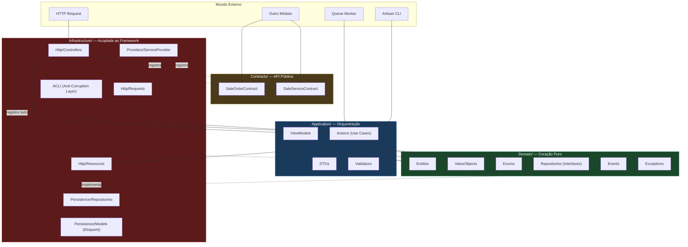

# Anatomia DDD do Módulo: Como Cada Pasta se Conecta aos Princípios

Este documento mapeia **cada pasta e arquivo** da estrutura `Modules/Sale/` ao princípio de DDD que ela implementa, com exemplos de código concretos e as regras que cada camada deve obedecer.

---

## Visão Geral das Camadas



> **Regra de ouro das setas**: Dependências apontam **para dentro** (Infrastructure → Application → Domain). O Domain **nunca** aponta para fora.

---

## 1. `Domain/` — O Coração Puro

**Princípio DDD**: *O domínio é o centro de tudo e não depende de nada externo.*

Esta pasta contém **exclusivamente PHP puro**. Nenhum `use Illuminate\...`, nenhum `use Nwidart\...`, nenhum acoplamento com banco de dados, HTTP ou framework. Se você deletar o Laravel inteiro, o código desta pasta ainda compila.

### 1.1 `Domain/Entities/`

**Princípio**: *Entity — Um objeto com identidade única que persiste ao longo do tempo.*

Uma Entidade não é um Eloquent Model. Ela é um objeto PHP puro que encapsula **regras de negócio**, possui uma identidade (`$id`) e protege seus invariantes.

```php
namespace Modules\Sale\Domain\Entities;

use Modules\Sale\Domain\ValueObjects\OrderTotal;
use Modules\Sale\Domain\Enums\OrderStatus;
use Modules\Sale\Domain\Events\SaleOrderCompleted;
use Modules\Sale\Domain\Exceptions\InvalidOrderTransitionException;

final class SaleOrder
{
    private array $domainEvents = [];

    public function __construct(
        private readonly string $id,
        private readonly string $customerId,
        private OrderStatus $status,
        private OrderTotal $total,
        private readonly \DateTimeImmutable $createdAt,
    ) {}

    // ✅ A regra de transição de status vive AQUI, não num controller
    public function complete(): void
    {
        if ($this->status !== OrderStatus::Pending) {
            throw InvalidOrderTransitionException::cannotComplete($this->status);
        }

        $this->status = OrderStatus::Completed;

        // O evento é registrado, mas NÃO despachado aqui.
        // Quem despacha é a camada Application, após persistir.
        $this->domainEvents[] = new SaleOrderCompleted(
            orderId: $this->id,
            total: $this->total->value(),
        );
    }

    public function cancel(string $reason): void
    {
        if ($this->status === OrderStatus::Completed) {
            throw InvalidOrderTransitionException::cannotCancel();
        }
        $this->status = OrderStatus::Cancelled;
    }

    // A entidade calcula — não delega para o controller
    public function applyDiscount(float $percentage): void
    {
        $this->total = $this->total->withDiscount($percentage);
    }

    public function pullDomainEvents(): array
    {
        $events = $this->domainEvents;
        $this->domainEvents = [];
        return $events;
    }

    // Getters públicos — a entidade controla o que expõe
    public function id(): string { return $this->id; }
    public function status(): OrderStatus { return $this->status; }
    public function total(): OrderTotal { return $this->total; }
}
```

> [!IMPORTANT]
> **Regra**: A Entidade guarda as regras de negócio. Se você precisa de um `if` para validar uma transição de estado, esse `if` mora aqui — não no Controller, não na Action, não no Listener.

---

### 1.2 `Domain/ValueObjects/`

**Princípio**: *Value Object — Objeto sem identidade própria, definido pelos seus atributos. Imutável.*

Dois Value Objects são iguais se seus valores são iguais (como duas notas de R$10 — não importa qual é qual, o valor é o mesmo).

```php
namespace Modules\Sale\Domain\ValueObjects;

use InvalidArgumentException;

final readonly class OrderTotal
{
    public function __construct(
        private float $value
    ) {
        if ($value < 0) {
            throw new InvalidArgumentException(
                "Total do pedido não pode ser negativo: {$value}"
            );
        }
    }

    public function value(): float
    {
        return $this->value;
    }

    public function withDiscount(float $percentage): self
    {
        // Imutável: retorna nova instância em vez de mutar
        return new self(
            $this->value * (1 - $percentage / 100)
        );
    }

    public function add(self $other): self
    {
        return new self($this->value + $other->value);
    }

    public function equals(self $other): bool
    {
        return $this->value === $other->value;
    }
}
```

> [!TIP]
> **Quando criar um VO?** Sempre que um valor tem regras de validação ou operações próprias. Se você tem um `if ($total < 0)` espalhado em 5 lugares, isso deveria ser um Value Object que valida no construtor.

---

### 1.3 `Domain/Enums/`

**Princípio**: *Ubiquitous Language — Os termos do código devem refletir a linguagem do negócio.*

Enums são o mecanismo mais limpo do PHP 8.1 para representar estados finitos do domínio.

```php
namespace Modules\Sale\Domain\Enums;

enum OrderStatus: string
{
    case Draft = 'draft';
    case Pending = 'pending';
    case Completed = 'completed';
    case Cancelled = 'cancelled';

    // As transições válidas são definidas AQUI, no domínio
    public function canTransitionTo(self $target): bool
    {
        return match($this) {
            self::Draft     => in_array($target, [self::Pending, self::Cancelled]),
            self::Pending   => in_array($target, [self::Completed, self::Cancelled]),
            self::Completed => false,
            self::Cancelled => false,
        };
    }
}
```

---

### 1.4 `Domain/Repositories/`

**Princípio**: *Repository Pattern — A interface de persistência é definida no domínio, mas a implementação vive na infraestrutura.*

Esta pasta contém **apenas interfaces**. O domínio diz "eu preciso salvar e buscar SaleOrders", mas **não sabe** se é MySQL, Postgres, Redis ou uma API REST.

```php
namespace Modules\Sale\Domain\Repositories;

use Modules\Sale\Domain\Entities\SaleOrder;

interface SaleOrderRepositoryInterface
{
    public function findById(string $id): ?SaleOrder;
    public function save(SaleOrder $order): void;
    public function delete(string $id): void;

    /** @return SaleOrder[] */
    public function findByCustomer(string $customerId): array;
}
```

> [!IMPORTANT]
> **Por que a interface fica no Domain e não no Infrastructure?** Porque o domínio *depende* desta interface (ele a usa). Se ela ficasse no Infrastructure, o Domain teria uma seta de dependência apontando para fora — e isso viola o **Dependency Inversion Principle**. A interface no Domain permite que o Infrastructure *implemente* o contrato sem que o Domain saiba da existência do Eloquent.

---

### 1.5 `Domain/Events/`

**Princípio**: *Domain Events — "Algo de importante aconteceu no domínio."*

Eventos de domínio são POPOs (Plain Old PHP Objects) que registram **fatos** que ocorreram. Quem ouve esses eventos é responsabilidade de outras camadas.

```php
namespace Modules\Sale\Domain\Events;

final readonly class SaleOrderCompleted
{
    public function __construct(
        public string $orderId,
        public float $total,
    ) {}
}
```

> [!WARNING]
> Este **não** é um `Illuminate\Events\Dispatchable`. É um objeto puro. A camada Application é que pega esse evento e decide se despacha via `event()` do Laravel, se coloca numa fila, ou se faz qualquer outra coisa. O domínio registra o fato, a infraestrutura decide como entregá-lo.

---

### 1.6 `Domain/Exceptions/`

**Princípio**: *Exceptions de domínio comunicam violações de regras de negócio, não erros técnicos.*

```php
namespace Modules\Sale\Domain\Exceptions;

use Modules\Sale\Domain\Enums\OrderStatus;

final class InvalidOrderTransitionException extends \DomainException
{
    public static function cannotComplete(OrderStatus $current): self
    {
        return new self(
            "Não é possível completar um pedido com status '{$current->value}'. "
            . "Apenas pedidos 'pending' podem ser completados."
        );
    }

    public static function cannotCancel(): self
    {
        return new self(
            "Pedidos já completados não podem ser cancelados."
        );
    }
}
```

> Named constructors (`cannotComplete`, `cannotCancel`) tornam o código que lança a exception mais legível que `throw new InvalidOrderTransitionException("mensagem genérica")`.

---

## 2. `Application/` — A Camada de Orquestração

**Princípio DDD**: *Application Services coordenam o trabalho entre Domínio e Infraestrutura. Eles não contêm regras de negócio.*

A Application é um **maestro de orquestra**: ela diz ao violinista (Entidade) quando tocar e ao técnico de som (Repository) quando gravar, mas ela mesma não toca nenhum instrumento.

### 2.1 `Application/Actions/`

**Princípio**: *Use Case / Application Service — Uma operação completa que o sistema expõe.*

```php
namespace Modules\Sale\Application\Actions;

use Modules\Sale\Application\DTOs\CreateSaleOrderData;
use Modules\Sale\Domain\Entities\SaleOrder;
use Modules\Sale\Domain\ValueObjects\OrderTotal;
use Modules\Sale\Domain\Enums\OrderStatus;
use Modules\Sale\Domain\Repositories\SaleOrderRepositoryInterface;

final class CreateSaleOrder
{
    public function __construct(
        private SaleOrderRepositoryInterface $repository,
        // ↑ Injetado via Service Container. A Action não sabe se é Eloquent ou Mongo.
    ) {}

    public function handle(CreateSaleOrderData $data): SaleOrder
    {
        // 1. Cria a entidade de domínio (regras validadas no construtor)
        $order = new SaleOrder(
            id: (string) \Illuminate\Support\Str::uuid(),
            customerId: $data->customerId,
            status: OrderStatus::Draft,
            total: new OrderTotal($data->totalAmount),
            createdAt: new \DateTimeImmutable(),
        );

        // 2. Persiste via interface (não sabe o "como")
        $this->repository->save($order);

        // 3. Despacha eventos de domínio que a entidade registrou
        foreach ($order->pullDomainEvents() as $event) {
            event($event); // Agora sim usamos o Laravel — na camada Application
        }

        return $order;
    }
}
```

> [!IMPORTANT]
> **Observe**: A Action não faz `SaleOrder::create($data)` (Eloquent). Ela instancia uma Entidade pura, chama o Repository, e despacha eventos. Se amanhã você trocar Eloquent por Doctrine, esta classe **não muda**.

---

### 2.2 `Application/DTOs/`

**Princípio**: *Data Transfer Object — Estrutura de dados tipada para transportar informação entre camadas.*

O DTO é um contrato de entrada. Ele garante que a Action recebe dados no formato correto, sem depender de `Request` do Laravel ou de arrays associativos.

```php
namespace Modules\Sale\Application\DTOs;

final readonly class CreateSaleOrderData
{
    public function __construct(
        public string $customerId,
        public float $totalAmount,
        public array $items,
    ) {}

    // Factory method para criar a partir de um Request do Laravel
    // (a conversão framework → DTO acontece na borda, não no coração)
    public static function fromRequest(\Illuminate\Http\Request $request): self
    {
        return new self(
            customerId: $request->validated('customer_id'),
            totalAmount: $request->validated('total_amount'),
            items: $request->validated('items'),
        );
    }

    // Factory method para criar de um array qualquer (testes, CLI, etc.)
    public static function fromArray(array $data): self
    {
        return new self(
            customerId: $data['customer_id'],
            totalAmount: $data['total_amount'],
            items: $data['items'] ?? [],
        );
    }
}
```

> **Por que não passar o Request direto para a Action?** Porque a Action seria acoplada ao HTTP. E se ela for chamada por um comando Artisan? Ou por um Job de fila? Ou por outro módulo via `CrossModuleAction`? O DTO garante que todos esses caminhos usam o mesmo contrato.

---

### 2.3 `Application/ViewModels/`

**Princípio do livro Beyond CRUD**: *View Models preparam dados exclusivamente para apresentação, mantendo controllers limpos e views desacopladas da estrutura do banco.*

```php
namespace Modules\Sale\Application\ViewModels;

use Modules\Sale\Domain\Entities\SaleOrder;

final class SaleOrderIndexViewModel
{
    public function __construct(
        private array $orders,
        private int $totalCount,
    ) {}

    // A View chama métodos, não acessa properties do banco
    public function orders(): array
    {
        return array_map(fn(SaleOrder $o) => [
            'id'     => $o->id(),
            'total'  => 'R$ ' . number_format($o->total()->value(), 2, ',', '.'),
            'status' => $o->status()->value,
            'badge'  => $this->statusBadge($o->status()),
        ], $this->orders);
    }

    public function totalCount(): int { return $this->totalCount; }

    public function hasOrders(): bool { return $this->totalCount > 0; }

    private function statusBadge(\Modules\Sale\Domain\Enums\OrderStatus $status): string
    {
        return match($status) {
            OrderStatus::Draft     => 'secondary',
            OrderStatus::Pending   => 'warning',
            OrderStatus::Completed => 'success',
            OrderStatus::Cancelled => 'danger',
        };
    }
}
```

---

### 2.4 `Application/Validators/`

**Papel**: Regras de validação do Laravel (`FormRequest` rules) que são específicas da aplicação, não do domínio.

```php
namespace Modules\Sale\Application\Validators;

final class CreateSaleOrderRules
{
    public static function rules(): array
    {
        return [
            'customer_id'  => ['required', 'uuid', 'exists:customers,id'],
            'total_amount' => ['required', 'numeric', 'min:0.01'],
            'items'        => ['required', 'array', 'min:1'],
            'items.*.product_id' => ['required', 'uuid'],
            'items.*.quantity'   => ['required', 'integer', 'min:1'],
        ];
    }
}
```

> A diferença entre validação de **Application** e validação de **Domain**: `'exists:customers,id'` é Application (depende do banco). `Total não pode ser negativo` é Domain (regra de negócio no Value Object).

---

## 3. `Infrastructure/` — O Adaptador ao Framework

**Princípio DDD**: *A infraestrutura implementa os contratos definidos pelo domínio e conecta o sistema ao mundo externo (banco, HTTP, filas, APIs de terceiros).*

### 3.1 `Infrastructure/Persistence/Models/`

**Papel**: O Eloquent Model é o **mecanismo de persistência**, não a entidade de negócio.

```php
namespace Modules\Sale\Infrastructure\Persistence\Models;

use Illuminate\Database\Eloquent\Model;
use Illuminate\Database\Eloquent\Concerns\HasUuids;
use Modules\Sale\Contracts\SaleOrderContract;

class SaleOrder extends Model implements SaleOrderContract
{
    use HasUuids;

    protected $table = 'sale_orders';

    protected $fillable = [
        'customer_id', 'status', 'total', 'completed_at',
    ];

    protected $casts = [
        'total' => 'decimal:2',
        'completed_at' => 'datetime',
    ];

    // Relações Eloquent aqui — são infraestrutura pura
    public function items()
    {
        return $this->hasMany(SaleOrderItem::class, 'order_id');
    }

    // Implementa o contrato público
    public function getTotal(): float { return $this->total; }
    public function getStatus(): string { return $this->status; }
}
```

---

### 3.2 `Infrastructure/Persistence/Repositories/`

**Princípio**: *O Repository traduz entre a Entidade de domínio e o mecanismo de persistência.*

```php
namespace Modules\Sale\Infrastructure\Persistence\Repositories;

use Modules\Sale\Domain\Entities\SaleOrder as SaleOrderEntity;
use Modules\Sale\Domain\Enums\OrderStatus;
use Modules\Sale\Domain\ValueObjects\OrderTotal;
use Modules\Sale\Domain\Repositories\SaleOrderRepositoryInterface;
use Modules\Sale\Infrastructure\Persistence\Models\SaleOrder as SaleOrderModel;

final class EloquentSaleOrderRepository implements SaleOrderRepositoryInterface
{
    public function findById(string $id): ?SaleOrderEntity
    {
        $model = SaleOrderModel::find($id);

        if (!$model) return null;

        // Traduz Eloquent Model → Entidade de Domínio
        return $this->toDomainEntity($model);
    }

    public function save(SaleOrderEntity $order): void
    {
        // Traduz Entidade de Domínio → Eloquent Model
        SaleOrderModel::updateOrCreate(
            ['id' => $order->id()],
            [
                'customer_id' => $order->customerId(),
                'status'      => $order->status()->value,
                'total'       => $order->total()->value(),
            ]
        );
    }

    public function delete(string $id): void
    {
        SaleOrderModel::destroy($id);
    }

    public function findByCustomer(string $customerId): array
    {
        return SaleOrderModel::where('customer_id', $customerId)
            ->get()
            ->map(fn ($m) => $this->toDomainEntity($m))
            ->all();
    }

    private function toDomainEntity(SaleOrderModel $model): SaleOrderEntity
    {
        return new SaleOrderEntity(
            id: $model->id,
            customerId: $model->customer_id,
            status: OrderStatus::from($model->status),
            total: new OrderTotal((float) $model->total),
            createdAt: new \DateTimeImmutable($model->created_at),
        );
    }
}
```

> [!TIP]
> O método `toDomainEntity()` é o ponto de tradução. Se você trocar o Eloquent por Doctrine ou por uma API REST, apenas este arquivo muda — toda a camada Domain e Application permanecem intocadas.

---

### 3.3 `Infrastructure/Http/Controllers/`

**Papel**: Recebe a requisição HTTP, converte para DTO, chama a Action, e retorna a resposta.

```php
namespace Modules\Sale\Infrastructure\Http\Controllers;

use Modules\Sale\Infrastructure\Http\Requests\CreateSaleOrderRequest;
use Modules\Sale\Application\Actions\CreateSaleOrder;
use Modules\Sale\Application\DTOs\CreateSaleOrderData;

class SaleOrderController
{
    public function store(
        CreateSaleOrderRequest $request,
        CreateSaleOrder $action
    ) {
        // Controller é MAGRO: converte, delega, responde
        $data = CreateSaleOrderData::fromRequest($request);
        $order = $action->handle($data);

        return response()->json(['id' => $order->id()], 201);
    }
}
```

---

### 3.4 `Infrastructure/Http/Requests/`

Validação HTTP usando as regras da Application:

```php
namespace Modules\Sale\Infrastructure\Http\Requests;

use Illuminate\Foundation\Http\FormRequest;
use Modules\Sale\Application\Validators\CreateSaleOrderRules;

class CreateSaleOrderRequest extends FormRequest
{
    public function rules(): array
    {
        return CreateSaleOrderRules::rules();
    }
}
```

---

### 3.5 `Infrastructure/Http/Resources/`

**Papel**: API Resources transformam dados para JSON de resposta.

```php
namespace Modules\Sale\Infrastructure\Http\Resources;

use Illuminate\Http\Resources\Json\JsonResource;

class SaleOrderResource extends JsonResource
{
    public function toArray($request): array
    {
        return [
            'id'     => $this->id,
            'status' => $this->status,
            'total'  => number_format($this->total, 2),
            'items'  => SaleOrderItemResource::collection($this->whenLoaded('items')),
        ];
    }
}
```

---

### 3.6 `Infrastructure/ACL/` — Anti-Corruption Layer

**Princípio DDD**: *Anti-Corruption Layer — Traduz conceitos de outro Bounded Context para o vocabulário do contexto atual.*

Quando o módulo CRM emite um evento `LeadConverted`, o conceito de "Lead" **não existe** no vocabulário de Vendas. O ACL traduz esse conceito externo para uma operação interna do módulo Sale.

```php
namespace Modules\Sale\Infrastructure\ACL;

use Modules\Crm\Domain\Events\LeadConverted;
use Modules\Sale\Application\Actions\CreateSaleOrder;
use Modules\Sale\Application\DTOs\CreateSaleOrderData;

class HandleLeadConverted
{
    public function __construct(
        private CreateSaleOrder $createSaleOrder
    ) {}

    public function handle(LeadConverted $event): void
    {
        // TRADUÇÃO: "Lead convertido" → "Criar pedido de venda draft"
        // O módulo Sale não sabe o que é um Lead.
        // O ACL pega dados do evento externo e cria um DTO interno.
        $this->createSaleOrder->handle(
            CreateSaleOrderData::fromArray([
                'customer_id'  => $event->customerId,
                'total_amount' => $event->estimatedValue,
                'items'        => [],
            ])
        );
    }
}
```

> [!WARNING]
> Sem o ACL, você teria código do tipo `$lead->quotations()->create(...)` — o módulo Sale manipulando diretamente objetos do CRM. Com o ACL, a tradução é explícita e a fronteira é clara.

---

### 3.7 `Infrastructure/Providers/SaleServiceProvider.php`

**Papel**: Cola tudo — registra bindings, morph maps, listeners e carrega rotas/views/migrations.

Código completo já documentado no [plano estratégico](file:///C:/Users/lucas.araujo/.gemini/antigravity/brain/a7033389-d8aa-408b-9c64-fe718f31e845/plano_estrategico_laravel_ddd.md).

---

## 4. `Contracts/` — A API Pública do Bounded Context

**Princípio DDD**: *Context Mapping — Bounded Contexts se comunicam através de interfaces explícitas, nunca acessando classes internas uns dos outros.*

```
Contracts/
├── SaleOrderContract.php        # "Qual a forma pública de um pedido?"
└── SaleServiceContract.php      # "Quais operações estão disponíveis?"
```

```php
// O que OUTROS módulos podem saber sobre um SaleOrder:
interface SaleOrderContract
{
    public function getTotal(): float;
    public function getStatus(): string;
    // NÃO expõe: complete(), cancel(), applyDiscount()
    // → Operações de mutação são internas ao módulo
}

// O que OUTROS módulos podem pedir ao módulo Sale:
interface SaleServiceContract
{
    public function findOrder(string $id): ?SaleOrderContract;
    public function getOrdersByCustomer(string $customerId): array;
    // NÃO expõe: createOrder(), deleteOrder()
    // → Criação/deleção acontece via eventos, não chamada direta
}
```

> [!IMPORTANT]
> **Tudo que está fora de `Contracts/` é PRIVADO.** Se o módulo CRM fizer `use Modules\Sale\Domain\Entities\SaleOrder`, isso é uma **violação de fronteira** que o comando `arch:check-boundaries` detectará.

---

## 5. `database/`, `routes/`, `resources/`

São pastas de suporte do Laravel, não do DDD. Mas obedecem à regra de encapsulamento do módulo:

| Pasta | Conteúdo | Carregado por |
|-------|----------|---------------|
| `database/migrations/` | Migrations exclusivas deste módulo | `loadMigrationsFrom()` no ServiceProvider |
| `database/factories/` | Factories para testes | `Factory::guessFactoryNamesUsing()` |
| `database/seeders/` | Seeds do módulo | `php artisan db:seed --class=...` |
| `routes/web.php` | Rotas web do módulo | ServiceProvider `boot()` |
| `routes/api.php` | Rotas API do módulo | ServiceProvider `boot()` |
| `resources/views/` | Blade views namespace `sale::` | `loadViewsFrom()` |

---

## 6. `tests/` — Testes Espelham as Camadas

```
tests/
├── Unit/
│   └── Domain/          # Testa Entidades, VOs, Enums sem banco, sem framework
└── Feature/
    └── Application/     # Testa Actions com banco real e ServiceProvider ativo
```

### Teste de Domínio (puro, sem Laravel)

```php
// tests/Unit/Domain/SaleOrderTest.php
class SaleOrderTest extends \PHPUnit\Framework\TestCase  // NÃO usa TestCase do Laravel
{
    public function test_cannot_complete_a_draft_order(): void
    {
        $order = new SaleOrder(
            id: 'uuid-1',
            customerId: 'cust-1',
            status: OrderStatus::Draft,
            total: new OrderTotal(100.00),
            createdAt: new \DateTimeImmutable(),
        );

        $this->expectException(InvalidOrderTransitionException::class);
        $order->complete(); // Draft → Completed não é transição válida
    }
}
```

### Teste de Application (com framework)

```php
// tests/Feature/Application/CreateSaleOrderTest.php
class CreateSaleOrderTest extends \Tests\TestCase
{
    public function test_creates_order_and_persists(): void
    {
        $action = app(CreateSaleOrder::class);

        $order = $action->handle(CreateSaleOrderData::fromArray([
            'customer_id' => 'cust-1',
            'total_amount' => 250.00,
            'items' => [],
        ]));

        $this->assertDatabaseHas('sale_orders', [
            'id' => $order->id(),
            'total' => 250.00,
        ]);
    }
}
```

---

## 7. `module.json` — Manifesto do Bounded Context

```json
{
    "name": "Sale",
    "events": {
        "publishes":  ["SaleOrderCompleted", "SaleOrderCancelled"],
        "subscribes": ["LeadConverted"]
    },
    "contracts": {
        "publishes": ["SaleOrderContract", "SaleServiceContract"]
    },
    "dependencies": ["Base"]
}
```

**Princípio DDD**: *Context Map — Documentação formal de como os Bounded Contexts se relacionam.*

O `module.json` é legível por humanos e por máquinas. O comando `arch:check-boundaries` valida que as declarações batem com a realidade do código.

---

## Resumo: Fluxo Completo de uma Requisição

```
HTTP POST /api/sale/orders
         │
         ▼
 ┌─ Infrastructure ─────────────────────────────────────┐
 │  Controller recebe Request                            │
 │  FormRequest valida (rules da Application/Validators) │
 └───────────────┬───────────────────────────────────────┘
                 │ CreateSaleOrderData (DTO)
                 ▼
 ┌─ Application ────────────────────────────────┐
 │  CreateSaleOrder::handle()                    │
 │  → Instancia Entidade (Domain)                │
 │  → Chama Repository::save() (interface)       │
 │  → Despacha Domain Events                     │
 └───────┬──────────────────────────┬────────────┘
         │                          │
         ▼                          ▼
 ┌─ Domain ──────┐   ┌─ Infrastructure ────────────┐
 │ SaleOrder      │   │ EloquentSaleOrderRepository │
 │ (regras puras) │   │ (persiste no MySQL)          │
 └────────────────┘   └────────────────────────────┘
```

**Direção das dependências**: Infrastructure → Application → Domain. Nunca o contrário.
